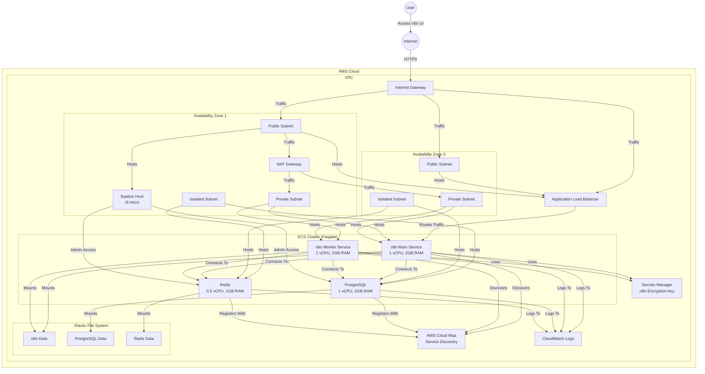

## Architecture Diagram

The diagram above illustrates the n8n infrastructure deployed on AWS using CDK. Here's a breakdown of the components:

### Network Layer
- **VPC** spanning 2 Availability Zones
- **Subnets** in each AZ:
  - Public subnets (for internet-facing resources)
  - Private subnets (for application components)
  - Isolated subnets (for database components)
- **Internet Gateway** for public internet access
- **NAT Gateway** for outbound internet access from private subnets

### Compute Layer
- **ECS Cluster** running Fargate tasks:
  - n8n Main Service (1 vCPU, 2GB RAM)
  - n8n Worker Service (1 vCPU, 2GB RAM)
  - PostgreSQL container (1 vCPU, 2GB RAM)
  - Redis container (0.5 vCPU, 1GB RAM)

### Storage Layer
- **EFS (Elastic File System)** with access points for:
  - n8n data persistence
  - PostgreSQL data persistence
  - Redis data persistence

### Access Layer
- **Application Load Balancer** for routing traffic to n8n services
- **Bastion Host** (t3.micro) for administrative access

### Supporting Services
- **AWS Cloud Map** for service discovery
- **Secrets Manager** for storing n8n encryption key
- **CloudWatch Logs** for centralized logging

### Data Flow
1. Users access the n8n UI through the internet-facing ALB
2. n8n services run in private subnets and communicate with PostgreSQL and Redis
3. All services mount EFS for persistent storage
4. Services discover each other using AWS Cloud Map
5. All components log to CloudWatch
6. Administrators can access the environment through the Bastion Host

This architecture provides a scalable, resilient, and secure environment for running n8n workflow automation platform on AWS.